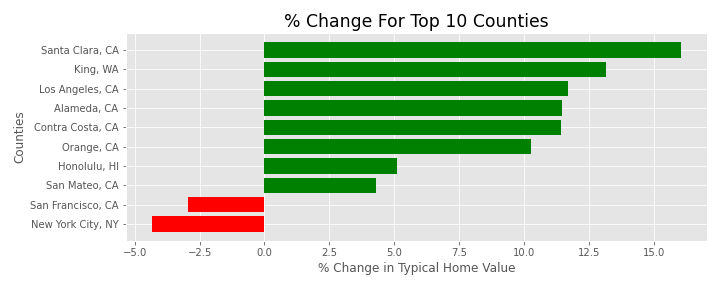
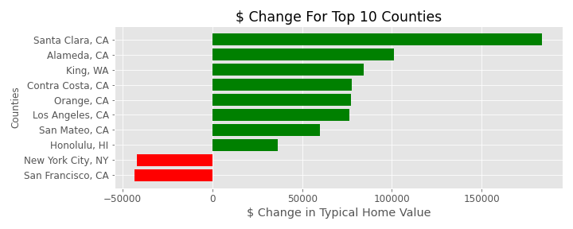

# Zillow Typical Home Prices vs COVID

## Background

For about the past year, COVID has wreaked havoc on the global economy. We have all been impacted by COVID in some way. Whether it has to do with your health, job, or locally in your home city/town. For me, I became a homeowner a few months before the shutdown took place and have been following housing price trends in the local area. Since then, there have been a massive number of people leaving the Bay Area. This phenomenon is known as the Bay Area Exodus.

Prior to starting this project, I believed that the housing market was in a decline due to COVID. Meaning, the home prices were falling while COVID cases were rising, since COVID forced the government to shutdown the economy. At the least, it appeared to be that way since the Zillow's value for my home was in decline (and is continuing to do so).

## Data

[Zillow](https://www.zillow.com/research/data/)

> Zillow Home Value Index (ZHVI): A smoothed, seasonally adjusted measure of the typical home value and market changes across a given region and housing type. It reflects the typical value for homes in the 35th to 65th percentile range. The raw version of that mid-tier ZHVI time series is also available.

> Typical Home Value: Based on the Zestimate of a given region, and a particular housing type. Zestimate values a home based on its characteristics and features such as location, # of bedrooms, # of bathrooms, parking spaces, year built, etc.

[COVID](https://github.com/nytimes/covid-19-data)

> COVID data was obtained from the New York Times GitHub. It includes information by the day for each county in the US for total confirmed COVID cases in the United State of America.

[CENSUS](https://www2.census.gov/programs-surveys/popest/datasets/2010-2019/counties/)

> United States Census data was used for population and area by county.

## EDA

I started with importing the Zillow ZHVI data and the COVID data. Specifically looking at the top 100 counties by population (top 100 counties). Out of the top 100 counties, only two had a negative correlation. San Francisco, CA and New York City, NY1. All other top 100 counties had a positive correlation. In other words, only San Francisco and New York's typical home prices fell, as COVID cases rose.

In exploring the data, it was noticed that neither data sets had population in its fields. So to get the population data, US Census information was added to find the population by county and to calculate the population density (population/area).

1 Data for New York City, NY includes all 5 boroughs, which are measured as separate counties on Zillow.

#### Top 10 Counties by Typical Housing Value

A look at change in value of the highest value markets in the nation and how values have changed (12/31/2019 to 02/28/2021).

## Correlation

As noted above, only two counties in the top 100 counties had a negative correlation (San Francisco -0.779 and New York -0.615). All other top 100 counties have a positive correlation.

#### Top 10 Counties by Typical Home Values Correlation

| County-State      |   Correlation |
|:------------------|--------------:|
| King, WA          |         0.763 |
| San Mateo, CA     |         0.719 |
| Santa Clara, CA   |         0.714 |
| Alameda, CA       |         0.713 |
| Contra Costa, CA  |         0.703 |
| Orange, CA        |         0.684 |
| Los Angeles, CA   |         0.676 |
| Honolulu, HI      |         0.341 |
| New York City, NY |        -0.615 |
| San Francisco, CA |        -0.779 |

#### USA Correlation

As you can see below, typical home values are increasing as COVID cases are increasing. There appears to be a positive correlation.

## Conclusion

Based on the month-to-month trend of the Typical Home Values and COVID Cases at month end between 12/31/2019 to 02/28/2021, there is a Pearson correlation of 0.825.

Even though COVID has been tough on many people, especially with those that have been personally affected, it doesn't appear as though the housing market has been affect. The typical housing value is still trending upwards even though cases rise.

The Bay Area Exodus does not appear to be quite true according to the typical home value, but it does appear people are tired of paying a ton of high prices for small spaces as indicated by the housing price changes of San Francisco and New York.

## Contact Information

Tony Nguyen\
tonyn513@gmail.com\
[LinkedIn](https://www.linkedin.com/in/tonymnguyen/)\
[Slides](https://docs.google.com/presentation/d/1EKAV-aX0lCX7fLuzYX91MKru1Ff5zKjTeLzBYiuHimM/edit#slide=id.gcd088b8d3b_0_125)